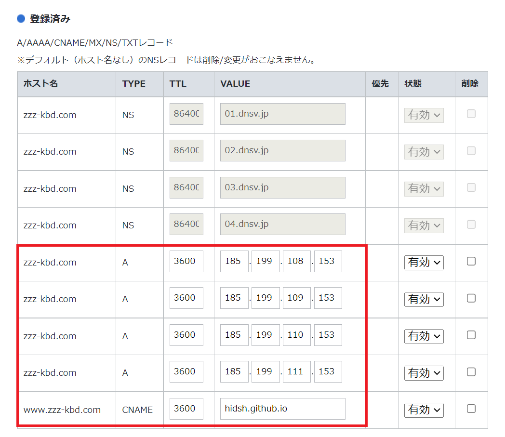
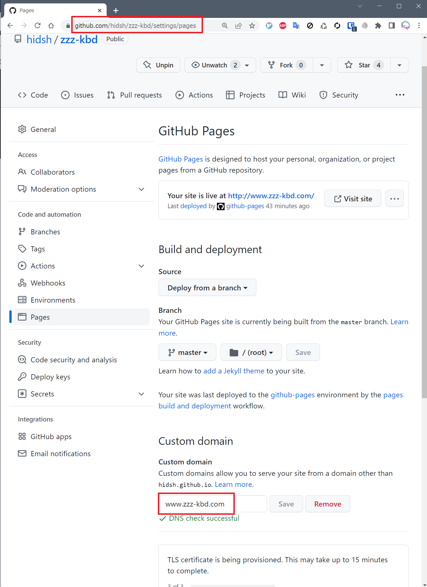

# zzz-kbd
Self Made Keyboard Maker

## DNS setting

- `https://www.zzz-kbd.com/` でアクセスできる
- `https://zzz-kbd.com/` でアクセスできる

設定は以下のように

1. お名前.com のDNS設定

- Aレコードは**ホスト名なし**で固定IPアドレスを4つ追加
- CNAMEレコードはホスト名を`www`にして`hidsh.github.io`で1つ追加

2. Github Pages のカスタムドメイン設定

1. Custom domain に`www`つきで記入して`Save`ボタンを押す
2. `Enforce HTTPS` にチェックを入れて15分ほど待つと`https:`でアクセスできるようになるはず
3. `DNS checked successfull`と表示されていても`https:`でアクセスできない場合は、一旦`Remove`ボタン押して、再度1をやってみる

ちなみに、お名前.comは何もしないと自動更新になっているので、それがイヤなら止めるように設定しておく
