# ino ビルドガイド

## 作り始める前に

いきなりこのページを見ながら作りだすのではなく、一通り目を通したあとで組立てを始めることをおすすめします。

作業を始める前に、 [キットに含まれているもの](./index.md#キットに含まれているもの) に不足がないことを確認してください。不足がある場合、発送日から2週間以内に連絡いただければ無料発送致します。

組立てに使う工具については [キット以外に必要なもの](./index.md/#キット以外に必要なもの) をご確認ください。

## マウスボタンスイッチのはんだ付け

左/右基板のおもて面にマウスボタン用のマイクロスイッチ（合計3つ）をハンダ付けします。

マイクロスイッチの向きは、写真のように青色の部分が基板の端に近くなるようにします。

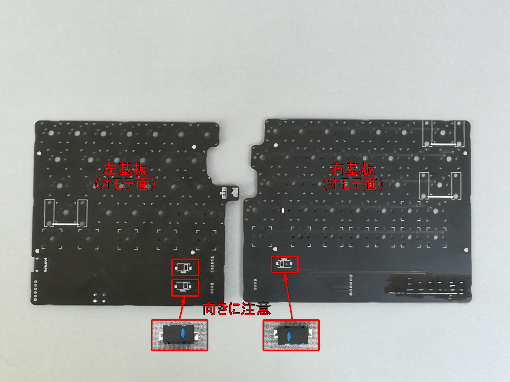

## 動作確認

組み立てる前に、ケーブルだけをつないで動作確認をしておきます。

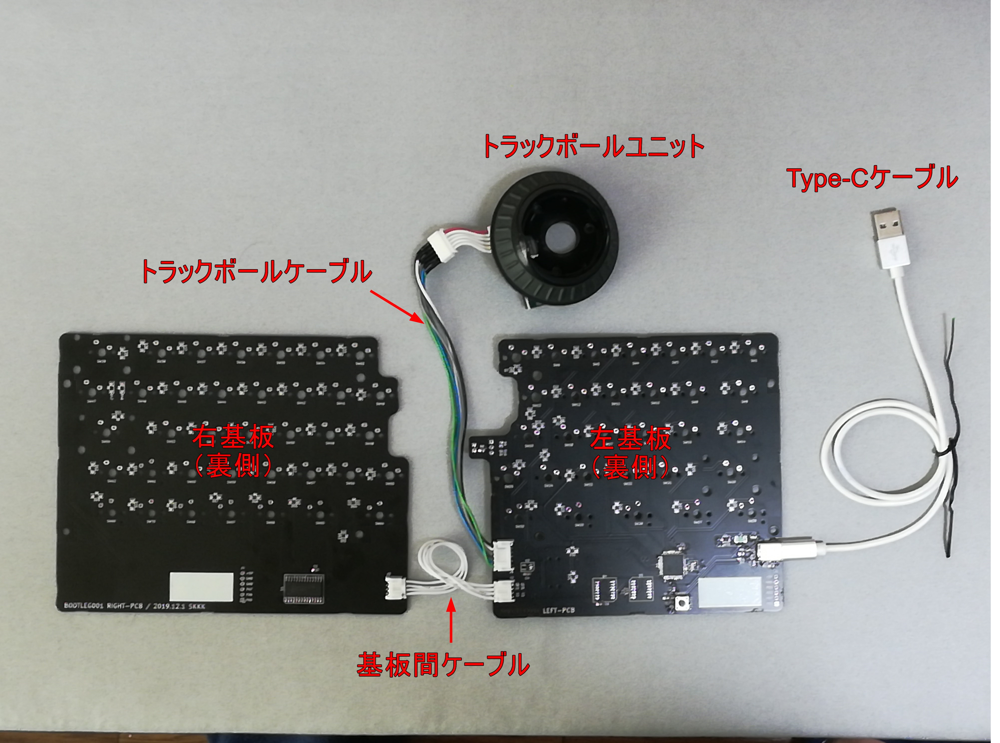

1. トラックボールケーブル(6ピン)を左基板に接続 熱収縮チューブが**入っていない方**を基板に接続してください。
1. トラックボールをトラックボールケーブル(6ピン)に接続
1. 基板間ケーブル(4ピン)を左基板と右基板に接続 向きはどちらでもOKです。
1. トラックボールユニットにボールを入れる
1. Type-C ケーブルを左基板と PC に接続

※ Type-C ケーブルは動作実績のある正常なものを使ってください。

マイコンにはファームウェアが書込まれているので、PC に接続すると HID キーボードとマウスの複合デバイスとして認識します。

以下の動作をウェブブラウザ等で確認してください。

- トラックボールを転がすとマウスポインタが移動すること
- マウスボタンのクリックが反応すること

※ 出荷前に全数検査しておりますが、もし問題があれば[yakshaver (twitter)](https://twitter.com/_gnrr) までDMください。

動作が確認できたら、トラックボールケーブルと基板間ケーブルを外しておきます。

## キースイッチのハンダ付け

MX スイッチと Choc スイッチをハンダ付けします。
スタビライザーもこの時点で取付けておきます。

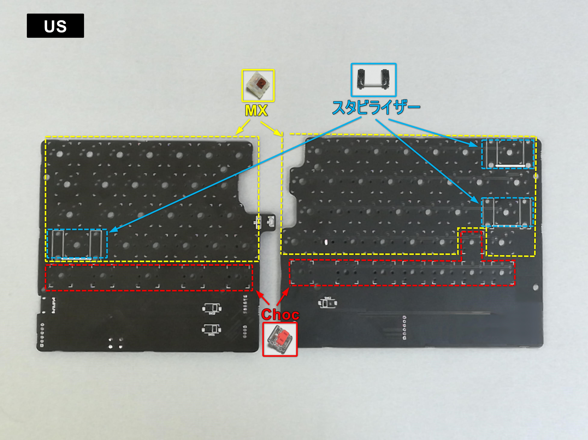

## ゴム足の取付け

ゴム足をケースに貼り付けます。

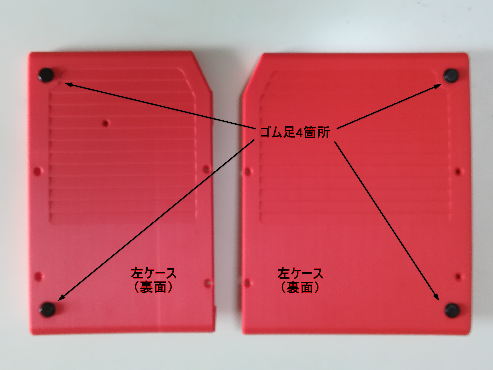

## スペーサの取付け

M2.6トラスネジで5mmスペーサーを取付けます。裏面とオモテ面を間違えないようにします。

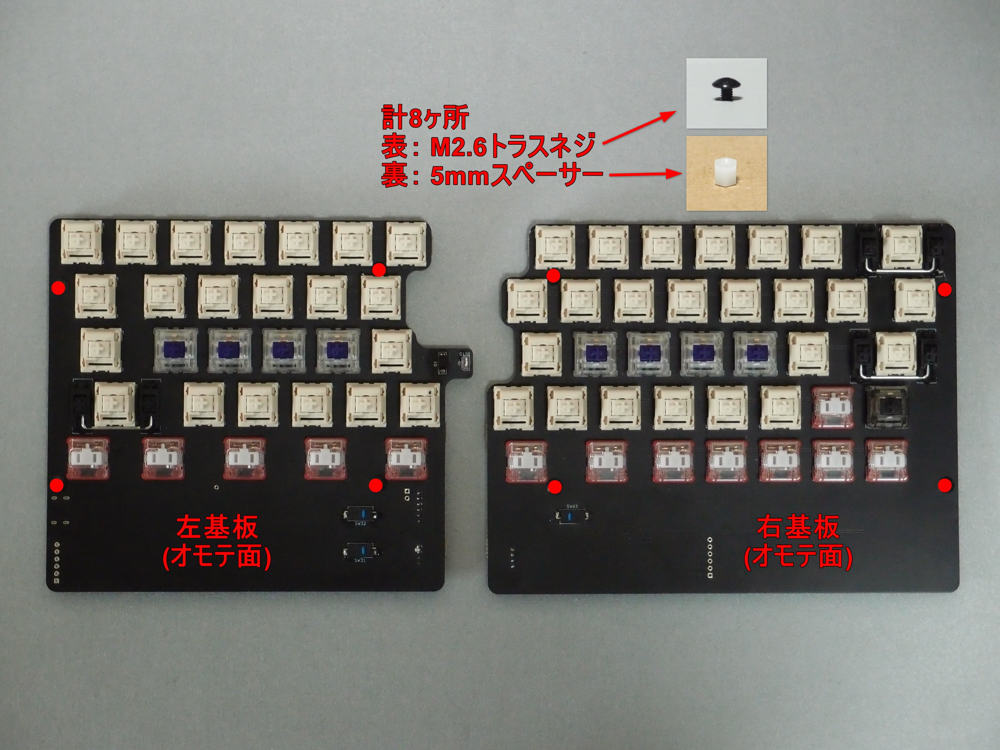

## 基板の取付け

下図の丸印の隙間に差し込むように、左ケースの横から左基板を入れます。

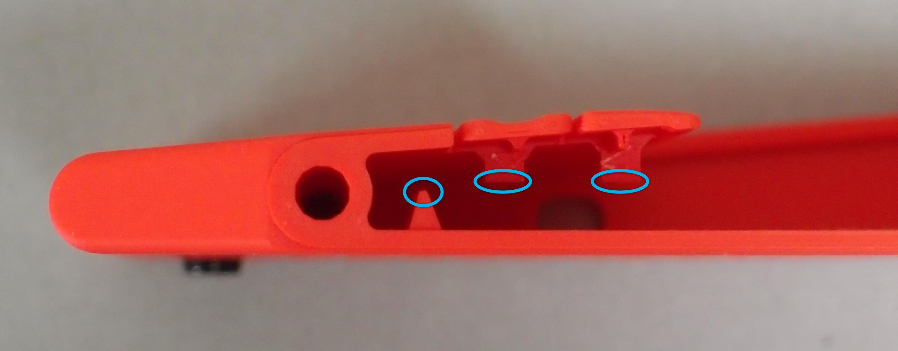

下図のように入ればOKです。

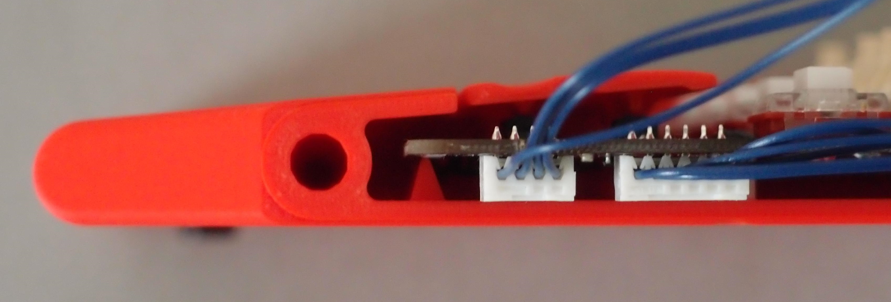

裏面からM2.6皿ねじ(下図)で4ヶ所を留めます。

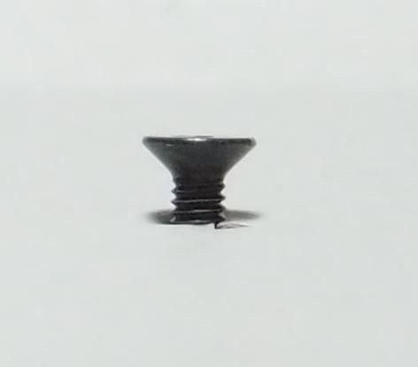

スペーサーは樹脂なので、締めすぎないように注意してください。

右ケースにも同様に右基板を差込んでねじで固定します。

## 左基板へのケーブル取付け

トラックボールケーブル(6ピン)と基板間ケーブル(4ピン)を左基板に接続します。

各コネクタの接続は[動作確認](#動作確認)のときと同じです。

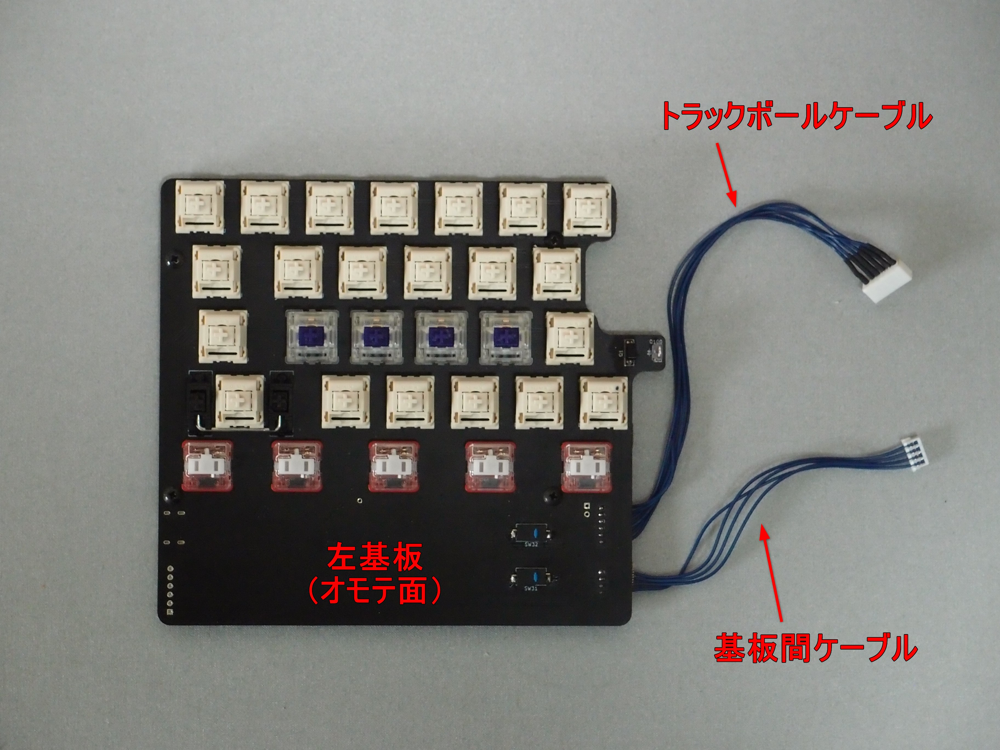

※ トラックボールユニットはまだ接続しません。

## パイプの差込み

下図のようにパイプを中央ケースに差込みます。

パイプは同じものなので、前後の区別はありません。

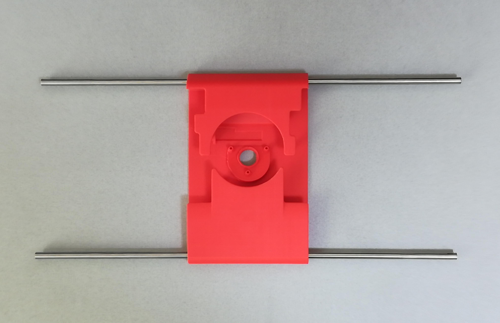

## 左ケースと中央ケースの組付け

左ケースの穴にパイプを通して中央ケースを寄せていきます。

中央ケースには下図の水色の部分に支柱があるので、それを避けるようにケーブルを矢印のように通します。あらかじめ、ケーブルをS字に曲げておくと通しやすいです。

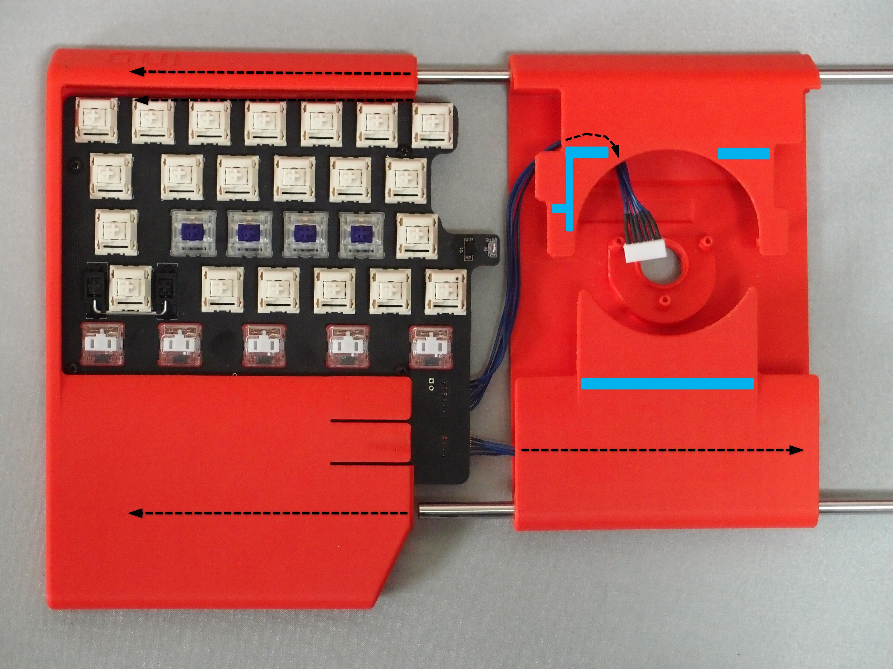

ケース同士を接合したときに、基板の端にある**スクロールセンサーの下をトラックボールケーブルがくぐる**ようにします。トラックボールケーブルが基板の上を通るとキーキャップやスクロールリングに干渉する恐れがあるので注意してください。

最終的に下図のようにケーブルが通っていればOKです。

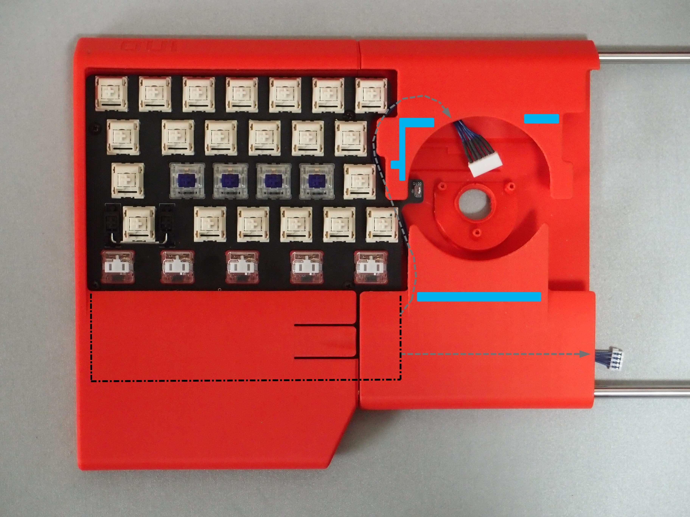

ケーブルがケースの間に挟まれないように注意してください。

## 右ケースと中央ケースの組付け

同様に、右ケースの穴にパイプを通して中央ケースを寄せていきます。

こちらも、ケーブルがケースの間に挟まれないように注意してください。基板間ケーブルが届く距離になったら、右基板に接続します。

このあとのボルト締めのために、ケース接合面を合わせておきます。

また、パイプの端面がザグリの面(ツラ)よりも突き出している場合は、押し込んでおきます。

## ボルト締め

前後左右の計4本の六角穴付きボルト(下図)をパイプの両端に締めこみます。

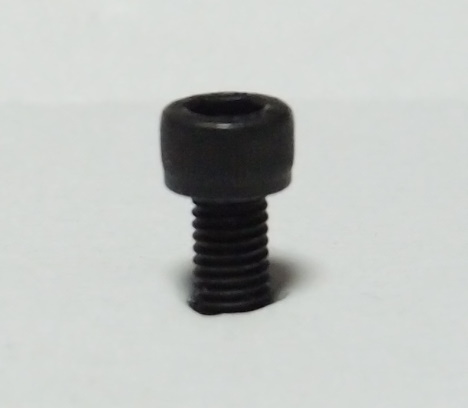

下記の手順で行ってください。

1. 左側の2本のボルトを指で締め込む。
1. 同様に右側も2本のボルトを指で締め込む。
1. 4本のボルトを指で締まる範囲で締め込んでいく。
1. 指で締まらなくなったら、2本のL字レンチの長い方を**後ろ側**の左右ボルトに差し込み、互いに逆方向にレンチを1回転させて締め込む。
1. 同様にL字レンチの長い方を**前側**の左右ボルトに差し込み、互いに逆方向にレンチを1回転させて締め込む。
1. 4 と 5 を繰り返し、前後が斜めにならないように注意しながら徐々に締め込んでいく。

ボルトを締めすぎるとケースを破損する可能性があるので、「ほどよく」締め付けてください。目安としては**L字レンチの短い方に指をかけて回した時、指が痛くならない程度**の締め具合としてください。

ソケットレンチやラチェットハンドル等を使わずに作業することをおすすめします。

この段階で下図のようになります。

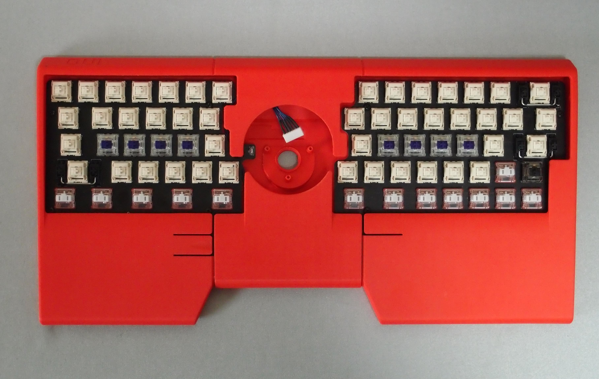

## トラックボールユニットの接続

トラックボールケーブルをトラックボールユニットに接続します。
トラックボールユニットをケースにはめたときに、ケーブルがケース内部に引っかからないように注意しておきます。

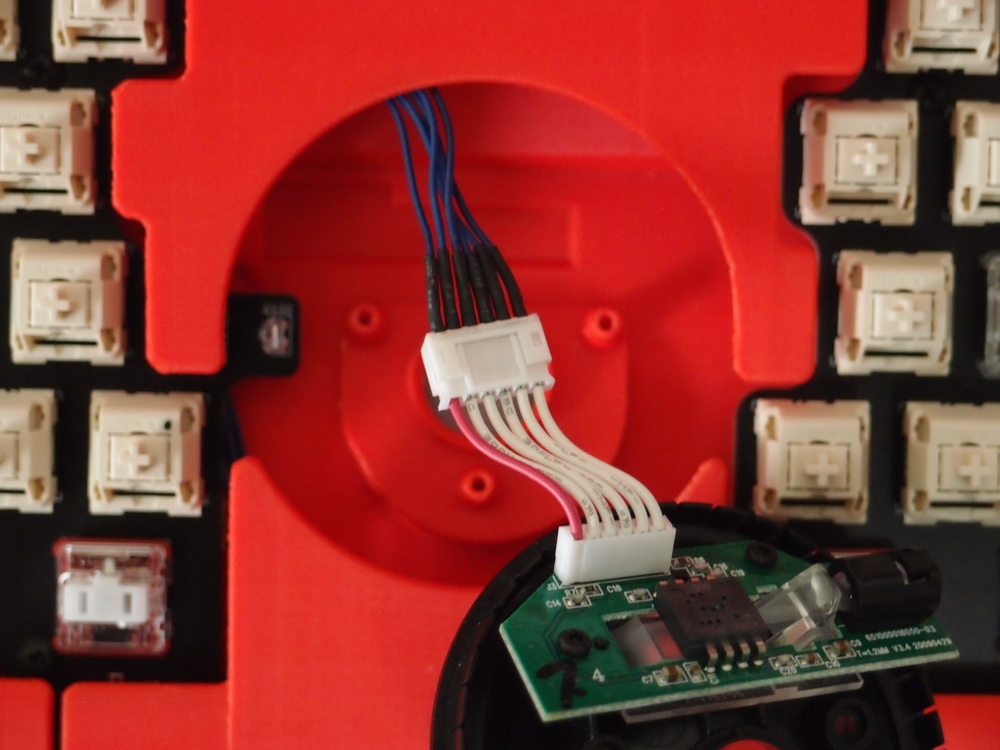

## トラックボールユニットの取付け

スクロールセンサの向きが変わるとスクロール動作に影響が出るので、トラックボールユニットが当たったり手で触らないように注意して作業してください。

下記の要領で行います。

1. トラックボールユニットを中央の丸い切り欠きに載せる。
1. トラックボールユニットの3本の小穴（下図の水色）を覗き込み、ケースの小穴と位置を合わせる。 
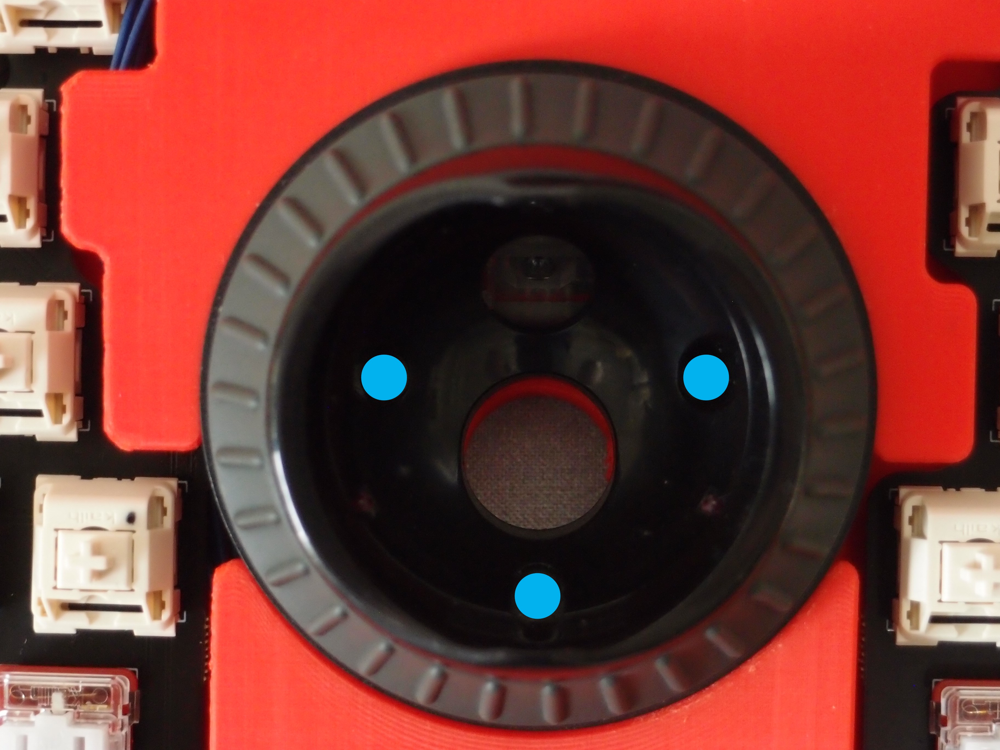

1. トラックボールユニットの後ろ側をケースの後ろ側の凹みにもぐり込ませる。 
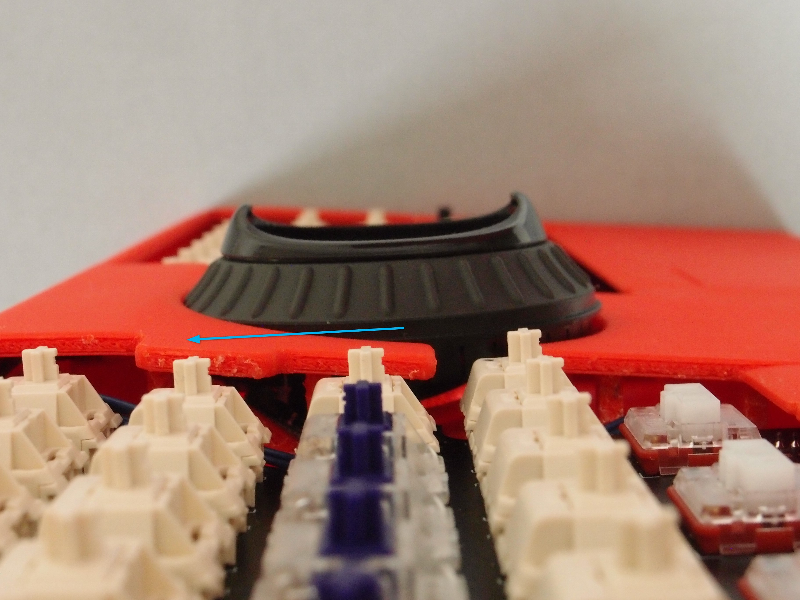

1. トラックボールユニットの手前側を押さえ、ケースの前側の凹みに潜り込ませる。 
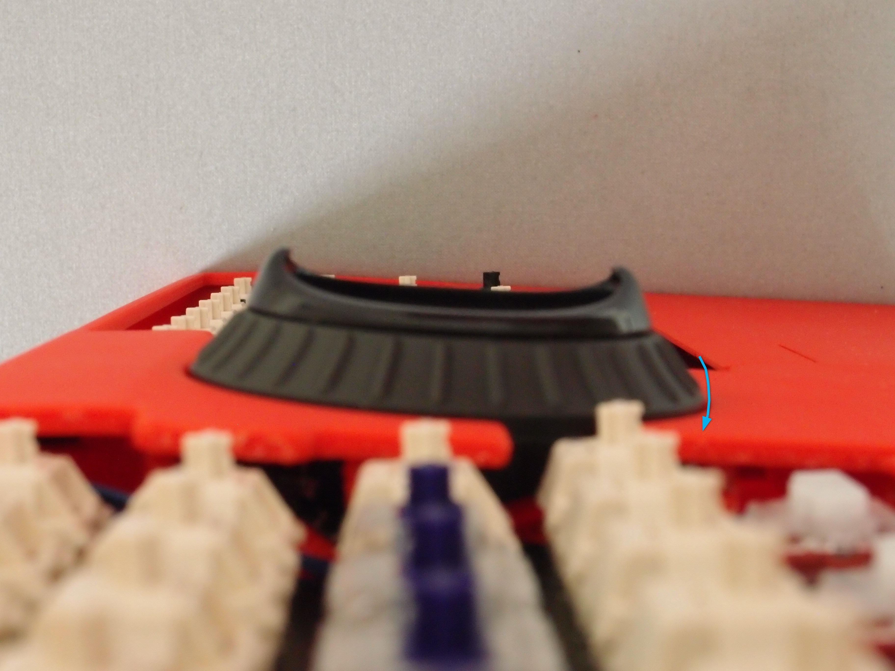

1. 穴位置を調整する。 トラックボールユニットの小穴がケースの小穴に合うようにトラックボールユニットをゆすって調整します。

1. タッピングねじ(下図) 3本をトラックボールユニットの小穴に入れる。 

1. タッピングねじをヘクスローブドライバー (T6)で締める。 タッピングねじなので、初めてねじ止めするときはドライバーの先端方向に少し押す感じで締め始めます。 
まず、3本ともゆるゆるの状態で締めておき、その後、それぞれ1/4回転ずつ回して締まり具合を確認しながら、3本が均等に締まるようにするとよいでしょう。 
強く締めすぎるとケースのネジ穴がバカになる恐れがあるので、若干弱めで締め付けを終わります。

最後に、スクロールリングを手で回して、ケースの端面やセンサに当たらずスムーズに回ることを確認します。

## キーキャップの取付け

下図を参考に、付属の Choc キーキャップを取付けます。
MXキーキャップはお好みのものをお使いください。

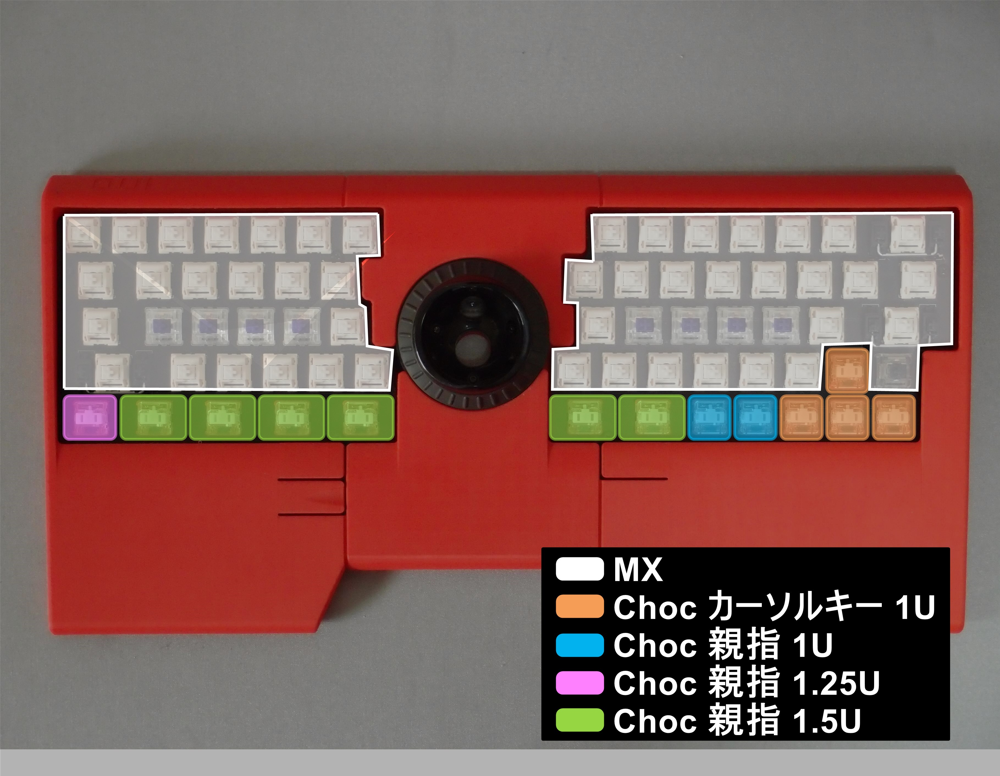

なお、キーキャップを取り外す際は、事前に[キーキャップの取り外し](#キーキャップの取り外し)を一読ください。

## ボールの取付け

トラックボールユニットにボールを入れると完成です。

-----

お疲れさまでした。

一般的なキーボードと構造が違うところがあるため、戸惑われたところもあったかと思います。

わかりにくいところなどございましたら、[yakshaver (twitter)](https://twitter.com/_gnrr) までフィードバックをいただけると嬉しいです。

なお、キーマップの変更など、各種設定については[ファームウェアガイド](./firmware-guide.md) をご覧ください。

さて、苦労して組立てたキーボードは長く使いたいものです。

[長くお使いいただくために](#長くお使いいただくために)には、ケースをバラすときの注意点やメンテナンスなど、今後役立つことを書きました。

ぜひ、ご一読ください。

-----

## 長くお使いいただくために

キーキャップの交換やケースをバラすときは以下にご注意ください。

### キーキャップの取り外し

キーキャップを外すときは、誤ってキープーラーをキースイッチに引っかけないように注意してください。

このキーボードはトッププレートがないため、キープーラーを奥まで差し込むとスイッチに引っかかりやすくなります。誤ってスイッチを引っ張ってしまうとスイッチや基板を破損する恐れがあります。

また、Choc は一度スイッチを分解するとトップハウジングのツメがゆるくなり、キーキャップを外すとトップハウジングごと外れてしまうことがあります。ルブしたスイッチやスプリング交換したスイッチを使う際はご注意ください。

### トラックボールユニットの取り外し

ケースをバラす際は、まず最初にトラックボールユニットを取り外すようにしてください。

トラックボールユニットを付けたまま、左右のボルトを緩めてケースを左右に引っ張ると基板上のセンサーがスクロールリングに引っかかり、センサーや基板を破損する恐れがあります。

もしセンサーの向きが変わってしまったら、垂直になるように指でゆっくりと直します。

### スクロールリングのメンテナンス

材質の特性上、スクロールリングのゴムは加水分解でベタついてきます。

ベタつきは無水エタノールやパーツクリーナーで除去できます。 パーツクリーナーを使用する場合は、プラスチックを侵さないものをお使いください。

### トラックボールのメンテナンス

マウスと違いトラックボールは光学式でも以下のようなメンテナンスが必要です。

- ボールについた皮脂を柔らかい布で拭き取る
- トラックボールの支持球(人工ルビー)についたホコリを柔らかい布で拭き取る

ポイント精度と操球感を維持するため、定期的に行うことをおすすめします。

### ボールの交換について

同じ直径のトラックボールであればボールを移植できますが、直径40mmのものはあまりありません。

|製品名|ボールの色|リンク|備考|
|---|---|---|---|
|Kensington Orbit with Scroll Ring K72337|青/ラメ|[Amazon](https://www.amazon.co.jp/dp/B084QQ2MB3/)|同梱品|
|Kensington Orbit with Scroll Ring K72500|シルバー/ラメ|[Amazon](https://www.amazon.co.jp/dp/B084QQ2MB3/)|同梱品と色違い|
|Kensington Orbit Optical KT-4327|シルバー/まだら|[Amazon](https://www.amazon.co.jp/dp/B01BXS17TA/)||
|Logicool TrackMan Marble TM-150r|赤黒/ドット|[Amazon](https://www.amazon.co.jp/dp/B00CBOVSOA/)|こすれ感あり|
|A4Tech WWT-5E|赤?|[Google 画像検索](https://www.google.com/search?q=A4Tech+WWT-5E&tbm=isch)|終息品|
|~~Microsoft Trackball Explorer 2.0~~|~~赤?~~|[猫のトラックボールルーム](http://mineko.fc2web.com/box/tb-room/items/microsoft-trackball-explorer2f.html)|エイプリルフールネタ|

他に40mmの球としては、卓球のボール、オルゴールボール、水晶玉が挙げられます。

ただし、水晶玉は直径40mmと記載があっても実際は個体差により誤差が大きいです。
透明のものでもトラックボールとしては動きますが、重量もあるので今ひとつでした。

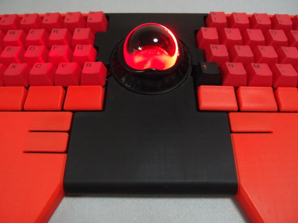

他に使えそうなものがありましたら、[yakshaver (twitter)](https://twitter.com/_gnrr) までお知らせいただければと思います。

----
## リンク
- [ino - トラックボールつき60%キーボード](./index.md)
- [ino ファームウェアガイド](./firmware-guide.md)
