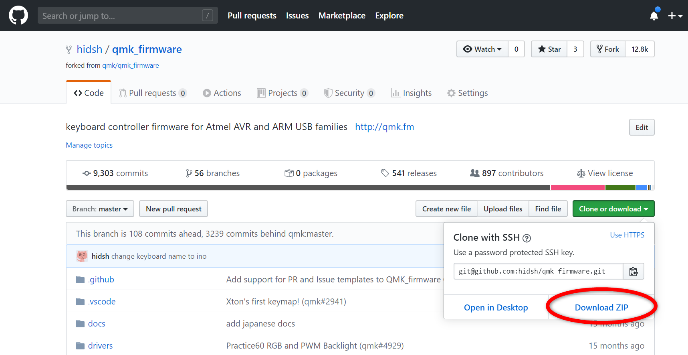
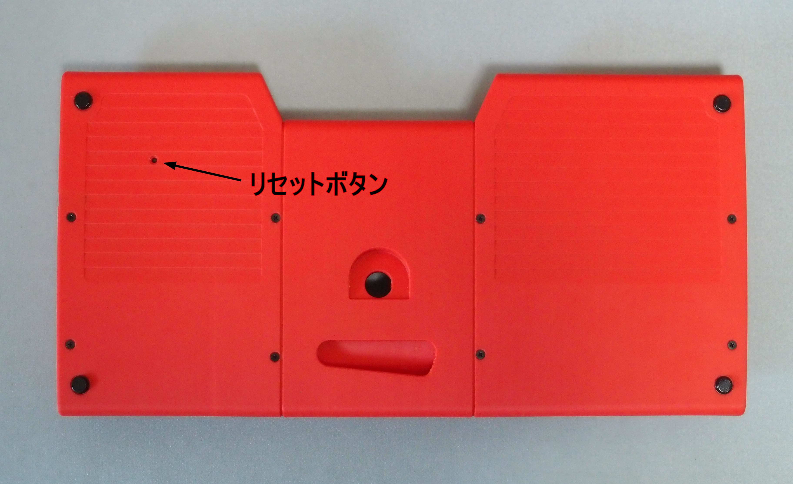

# ino ファームウェアガイド

## ファームウェアのビルド方法

マイコンにはデフォルトキーマップのファームウェアが書込まれています。

キーマップを変更するにはソースファイルを書き換えて、QMK Firmware をビルドしなおす必要があります。

### ビルドツールのインストール
QMK Firmware ドキュメントの [2. Prepare Your Build Environment](https://docs.qmk.fm/#/newbs_getting_started?id=set-up-your-environment) を参考に、ビルドに必要なツールをインストールします。

### ソースの取得
現状では QMK Firmware の本家にマージされてないので、[フォーク](https://github.com/hidsh/qmk_firmware)から最新をダウンロードします。



ダウンロードしたzipファイルは適当な場所に展開しておきます。

### ビルド

zipファイルを展開したフォルダの`qmk_firmware`フォルダに移動し、コマンドを入力します。

```
cd 展開したフォルダ/qmk_firmware
make ino:default
```

## マイコンへの書込み

マイコンへの書込みは以下の手順で行います。

### 1. 書込みコマンドを入力
ビルド時と同様にコマンドを入力しますが、ブートローダーとして`:avrdude`を指定します。<br>

```
cd 展開したフォルダ/qmk_firmware
make ino:default:avrdude
```

ビルドが正常に終わると、下記のように待ち状態になります。<br>

```
Detecting USB port, reset your controller now.....
```

### 2. リセットボタンを押す
待ち状態になったら、キーボード裏面にあるリセットボタンを**2回**押します。<br>


リセットボタンを押すときは、マウスのダブルクリックするときの要領で「チョンチョン」と押します。<br>
うまくいけば、3～5 秒後に書込みが始まります。<br>

### 3. 書込み確認
書込み中はトラックボールの赤LEDが点滅し、書込みが終了するとトラックボールの赤LEDが再び点灯します。

書込みが正常に終わると下記のようになります。

```
avrdude: verifying ...
avrdude: 22120 bytes of flash verified

avrdude: safemode: Fuses OK (E:CB, H:D8, L:FF)

avrdude done.  Thank you.
```

書込みができないときは、リセットボタンを押す間隔を調整したり、5秒以上待ってからもう一度試してみてください。

## カスタマイズについて

ここからはキーマップ等のカスタマイズの話しとなります。

関係するファイルは主に2つです。

|ファイル|説明|
|----|----|
|[qmk_firmware/keyboards/ino/keymaps/default/**keymap.c**](https://github.com/hidsh/qmk_firmware/blob/master/keyboards/ino/keymaps/default/keymap.c)|キーマップやレイヤの変更|
|[qmk_firmware/keyboards/ino/**config.h**](https://github.com/hidsh/qmk_firmware/blob/master/keyboards/ino/config.h)|ino 独自の設定や BootMagic の設定|


## レイヤ構成

デフォルトのレイヤ構成は下表のようになっています。

|レイヤ番号|説明|
|------|----|
|0|Mac 向けのキーマップ|
|1|Linux 向け (Ubuntu) のキーマップ|
|2|Windows 向けのキーマップ|
|14|Raise|
|15|Lower (割り付けなし)|

初期状態ではレイヤ 0 の Mac向けのキーマップが選択されています。

0～2のレイヤは QMK Firmware の BootMagic 機能により選択可能です。<br>
`スペース`と`0`～`2`を同時押ししながら USB ケーブルを接続すことで、それぞれ Mac/Linux/Windows 向けのキーマップを選択することができます。

選択されたキーマップはマイコンの EEPROM に保存され、次回以降の起動時にも適用されます。

BootMagic のキー割当ては `config.h` の 下記の部分で変更できます。

```
/*
#define BOOTMAGIC_KEY_SALT                        KC_SPACE      // The Bootmagic key
  :
*/
#define BOOTMAGIC_KEY_DEFAULT_LAYER_0             KC_0          // Make layer 0(Mac) the default layer
#define BOOTMAGIC_KEY_DEFAULT_LAYER_1             KC_1          // Make layer 1(Linux) the default layer
#define BOOTMAGIC_KEY_DEFAULT_LAYER_2             KC_2          // Make layer 2(Windows) the default layer
#define BOOTMAGIC_KEY_DEFAULT_LAYER_3             KC_NO         // Make layer 3 the default layer
#define BOOTMAGIC_KEY_DEFAULT_LAYER_4             KC_NO         // Make layer 4 the default layer
  :
```

## マウスボタン

通常のキーと同様に、マウスボタンもキーマップで設定できます。

|キー値|説明|ファイル|
|------|----|----|
|`KC_MSL`|左ボタン|keymap.c| 
|`KC_MSM`|中ボタン|keymap.c|
|`KC_MSR`|右ボタン|keymap.c|

左右ボタンの入れ替え、他のキーへの割当て、レイヤーでの切り替えなど自由に変更できます。

## 水平スクロール

`HSCRL`に設定したキーを押しながらスクロールリングを回すと、水平スクロールになります。

デフォルトでは左シフト`KC_LSFT`が割当てられています。

|キー値|説明|ファイル|
|------|----|----|
|`HSCRL`|水平スクロール時に同時押しするキー|keymap.c| 

ただし、水平スクロールはPCアプリ等の環境により動作しないことがあります。

## スクロール方向の反転

スクロールリングの方向は `SCROLL_INVERT` を `true` にすることで反転できます。

|シンボル|値 (太字はデフォルト)|説明|ファイル|
|------|------|----|----|
|`SCROLL_INVERT`|**false: そのまま**<br>true: 反転|スクロール方向の反転|config.h|

ただし、この設定はレイヤー切り替えとは独立しているため、各OSごとに切り替えることはできません。


## トラックボールの速度

11段階に変更可能です。数字が大きいほど速くなります。

|シンボル|値 (太字はデフォルト)|説明|ファイル|
|------|------|----|----|
|`TRACKBALL_RESOLUTION`|RES2_125CPI (最遅)<br>RES2_250CPI<br>RES2_375CPI<br>**RES2_500CPI**<br>RES2_625CPI<br>RES2_750CPI<br>RES2_850CPI<br>RES2_1000CPI<br>RES2_1125CPI<br>RES2_1250CPI<br>RES2_1375CPI (最速)<br>|トラックボールの速度調整|config.h|

## トラックボールの向き

1°単位でトラックボールの向きを調整できます。

+で反時計方向(CCW)に、-で時計方向(CW)にずらします。デフォルト値は 0° です。

|シンボル|値 |説明|ファイル|
|------|------|----|----|
|`TRACKBALL_AZIMUTH_ADJ`|-45(CW) ～ 45(CCW)|トラックボールの向き調整|config.h|

----
## リンク
- [ino - トラックボールつき60%キーボード](./index.md)
- [ino ビルドガイド](./build-guide.md)