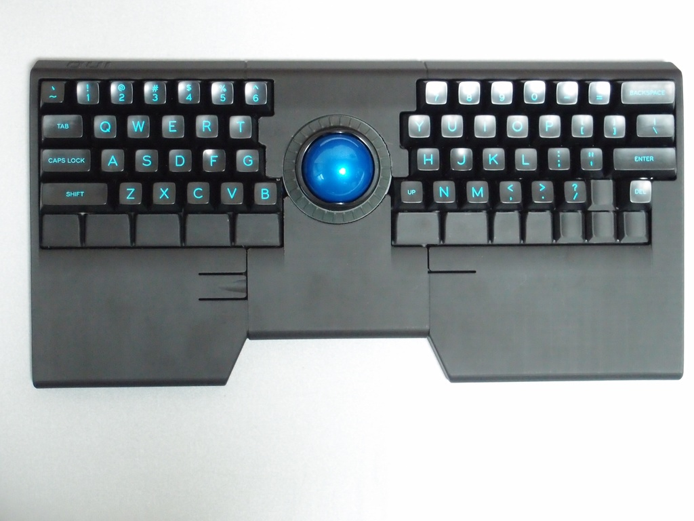

# ino - トラックボールつき60%キーボード

トラックボールを中央に載せた60%キーボードです。

- Kensington製のスクロールリング付きトラックボールユニットを使用
- 最下段のキー(Alt/Ctrlキー、カーソルキーなど）には Kailh Choc (背低スイッチ)を使用
- マウスボタンにはハイエンドのマウスに使われている OMRON製マイクロスイッチを使用
- PC 接続は USB **Type-C**
- パームレスト一体型3分割3Dプリント製ケース
- ステンレスパイプで結合する高剛性ケース構造
- ケース裏面に膝上使用時の滑り止めパターンと壁掛けフック用の穴を配置
- 一般的なキーボードからの移行コストを下げるUS/JIS配列60%レイアウト (ただし、Bキーは左右2つ)
- **スイッチ以外の部品はハンダづけ済み**
- 専用 Chocキーキャップ一式付き（カーソルキー用を含む）
- 複数のカラバリに対応 (Pure-Black/Red/Sky-Blue/Yellow/Orange/Cool-Grey)

コーディングのみならずOfficeやCAD、フォトレタッチ、果てはRTSなどのゲームにも使えるマルチロールな膝上キーボードを目指して設計しました。

肩の力を抜いた自然な姿勢で「ゆる」コンピューティングライフをお楽しみください。
## デフォルトキーマップ

## ご注意

- このキーボードは完成品ではなく、**組立てキット**となっています。完成させるにはハンダ付けや組立てが必要です。
- キット以外に、**キースイッチやMXキーキャップ等が必要**となります。また、組立てに使う**工具も必要**です。詳しくは [キット以外に必要なもの](#キット以外に必要なもの) をご確認ください。
- MX/Chocスイッチともに、**ソケットには対応していません**。
- 出荷時に**ファームウェアが書き込まれています**。キーマップを変更するには GitHubからソースファイルを取得し、ビルドする必要があります。
- ケースとChoc用キーキャップは3Dプリントで製造しているため、原理上、**積層痕やサポート材の痕跡**が発生します。また製造中の急激な温度変化や地震により、**段差、焦げ**などが発生することがあります。
- 光りモノはトラックボールセンサの赤LED以外はついていません。
- 2020年5月中旬にBOOTH他にて発売予定

## キットに含まれているもの

| 部品名|数量|説明|
|------|----|----|
|左基板|1枚|スイッチ以外は実装済み|
|右基板|1枚|スイッチ以外は実装済み|
|トラックボール ユニット|1個|スクロールリング付き|
|ボール|1個|青|
|トラックボールスイッチ|3個|要ハンダ付け|
|4ピンケーブル|1本|基板間接続用|
|6ピンケーブル|1本|トラックボール接続用|
|中央ケース|1個|3Dプリント品|
|左ケース|1個|3Dプリント品|
|右ケース|1個|3Dプリント品|
|ステンレスパイプ|2本|ケース結合用|
|M5 六角穴付きボルト|4本|ケース結合用|
|タッピングねじ (ヘクスローブ)|3本+予備|トラックボールユニット取付け用|
|M2.6 トラスねじ（+）|8本+予備|スペーサー上側取付け用|
|M2.6 皿ねじ (+)|8本+予備|スペーサー下側取付け用|
|M2.6 5mmスペーサー|8本|基板取付け用|
|Chocキーキャップ|カーソルキー 1U: 4個 親指 1U: 2個 親指 1.25U: 1個 親指 1.5U: 6個|ケースと同色/同素材|
|ゴム足|4個|黒

## キット以外に必要なもの

|名称|必要数|参考リンク|
|------|----|----|
|ハンダごて|1本|[amazon/白光 FX600](https://www.amazon.co.jp/dp/B006MQD7M4/)|
|こて台|1個|[amazon/白光 633-01](https://www.amazon.co.jp/dp/B000TGNWCS/)|
|糸ハンダ|適宜|[amazon/goot SE-06008](https://www.amazon.co.jp/dp/B001PR1L2S/)|
|六角レンチ (対辺4mm)|2本|[amazon/トラスコ TRRS40](https://www.amazon.co.jp/dp/B007R9FKZC/)|
|ヘクスローブドライバー (T6)|1本|[amazon/ANEX No.3543](https://www.amazon.co.jp/dp/B002SQLE90/)| 
|プラスドライバー (No.1)|1本|[amazon/ホーザン D-550-100](https://www.amazon.co.jp/dp/B007R13ONK/)| 
|Kailh Choc(v1) キースイッチ|13個|[遊舎工房/Kailhロープロファイルスイッチ](https://yushakobo.jp/shop/pg1350/)|
| MXキースイッチ|US 54個 JIS 55個|[TALP KEYBOARD/キースイッチ](https://talpkeyboard.stores.jp/?category_id=59cf8860ed05e668db003f5d)|
| MXスタビライザー (2U, PCBマウント)|3個|[遊舎工房/MXスイッチ スタビライザー](https://yushakobo.jp/shop/a0500st/)|
| MXキーキャップセット|1セット|[TALP KEYBOARD/キーキャップセット](https://talpkeyboard.stores.jp/?category_id=59be183f428f2d49120007b1)|
| USB TYPE-Cケーブル|1本|[amazon/Rampow USB Type C ケーブル](https://www.amazon.co.jp/dp/B081N1W39Y/)|

## 仕様

|||
|------|----|
|名称|ino|
|外形寸法|W382 x D192 x H25 mm (トラックボール, キーキャップ, ゴム足を含まず)|
|重量|約 800 g (トラックボール, キースイッチ, Tai-Hao Diabloキーキャップを含む)|
|形式/ユースケース|一体型 / ひざ上・卓上|
|接続方式|USB TYPE-C|
|配列 / キー数 (US)|ロウスタッガード / 67キー, MX 54個 (5ピン推奨) , Choc(v1) 13個|
|配列 / キー数 (JIS)|ロウスタッガード / 68キー, MX 55個 (5ピン推奨) , Choc(v1) 13個|
|マウント形式|PCBマウント (トッププレートなし)|
|キースイッチ取付け|ハンダづけ|
|トラックボール|直径40mm (青) スクロールリングつき|
|マウスボタンの数|3個 (ボタン位置はキーマップにて変更可能)|
|ケース|3Dプリント (ABS)|
|マイコン|ATMEGA32U4|
|ファームウェア|QMK Firmware (書込み済)|
