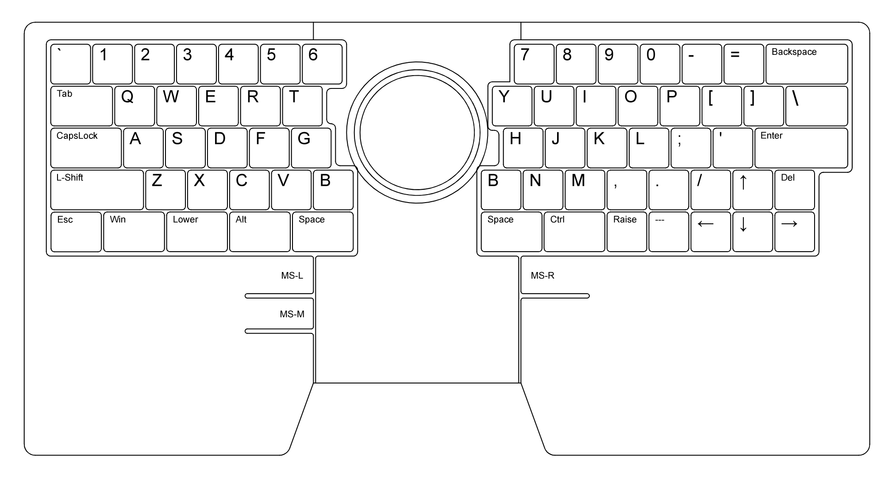

# ino - トラックボールつき60%キーボード

キーボード中央にトラックボールを載せた60%キーボードです。

- Kensington製のスクロールリング付きトラックボールユニットを使用
- CtrlキーやAltキーなど、最下段のキーに(Kailh Choc (背低スイッチ)を使用
- マウスボタンにハイエンドのマウスで使われているOMRON製マイクロスイッチを使用
- PC 接続は USB Type-C
- パームレスト兼用の3分割3Dプリント製ケース
- ケース裏面に膝上使用時の滑り止めパターンと壁掛けフック用の穴を配置
- ステンレスパイプで結合する高剛性ケース構造
- 一般的なキー配列からの移行障壁を最小化するUS配列60%レイアウト
- ただし、Bキーは左右2つ
- 最下段の親指/カーソルキー専用Chocキーキャップ一式付き
- 複数のカラバリに対応 (Pure-Black/Red/Sky-Blue/Yellow/Orange/Cool-Grey)

コーディングのみならずOfficeやCAD、Illustrator、果てはFPS/RTSなどのゲームにも使えるマルチロールな膝上キーボードを目指して設計しました。

肩の力を抜いた自然な姿勢で「ゆる」コンピューティングライフをお楽しみください。

## ご注意

- 2020年4月末にBOOTH他にて発売予定
- このキーボードは完成品ではなく、組立てキットとなっています。完成させるにはハンダづけや組立てが必要です。
- キット以外に、キースイッチやMXキーキャップ等が必要となります。また組立てに使う工具も必要です。詳しくは、[キット以外に必要なもの](#キット以外に必要なもの)をご確認ください。
- キーマップは出荷時にデフォルトキーマップが書き込まれています。キーマップを変更するには GitHubからソースファイルを取得し、ビルドする必要があります。
- `F1`等のキーは単独のキーとして配置されていないので、ファームウェアのレイヤー切替え機能を使って入力することになります（例：`RAISE`キーを押しながら`1`キー → `F1` ）
- ケースとChoc用キーキャップは3Dプリントで製造しているため、ケースには積層痕が発生します。また製造中の室温変化や地震により、段差、焦げ、サポート材の痕跡などが発生することがあります。

## キットに含まれているもの

| 部品名|数量|備考|
|------|----|----|
| 基板（左）|1枚|裏面実装済み|
| 基板（右）|1枚|裏面実装済み|
| 5mmスペーサー|8本|基板取付け用|
| トラックボールユニット|1個|スクロールリング付き|
| ボール|1個|青色|
| トラックボールボタン|3個|要ハンダ付け|
| 4ピンケーブル|1本|基板間接続用|
| 6ピンケーブル|1本|トラックボール接続用|
| ケース（左）|1個|3Dプリント品|
| ケース（右）|1個|3Dプリント品|
| ケース（中央|1個|3Dプリント品|
| ステンレスパイプ|2本|ケース結合用|
| 2mmタッピングねじ|3本+予備|トラックボールユニット取付け用|
| M2.6トラスねじ|8本+予備|基板上側取付け用|
| M2.6皿ねじ|8本+予備|基板下側取付け用|
| M5六角穴付きボルト|4本|ケース結合用|
| Chocキーキャップ（カーソルキー 1U）|4個|ケースと同色/同素材|
| Chocキーキャップ（親指 1U）|2個|ケースと同色/同素材|
| Chocキーキャップ（親指 1.25U）|1個|ケースと同色/同素材|
| Chocキーキャップ（親指 1.5U）|6個|ケースと同色/同素材|
| ゴム足 |4個|

## キット以外に必要なもの

|名称|必要数|参考リンク|
|------|----|----|
|ハンダごて|1本|[amazon](https://www.amazon.co.jp/dp/B006MQD7M4)|
|こて台|1個|[amazon](https://www.amazon.co.jp/dp/B000TGNWCS)|
|糸ハンダ|適宜|[amazon](https://www.amazon.co.jp/dp/B001PR1L28)|
|六角レンチ（対辺4mm） |2本|[amazon](https://www.amazon.co.jp/dp/B007R9FKZC)|
|ヘクスローブドライバー (T6)|1本|[amazon](https://www.amazon.co.jp/dp/B002SQLE90)| 
|Kailh Choc(v1) キースイッチ |13個|[遊舎工房](https://yushakobo.jp/shop/pg1350/)|
| MXキースイッチ |54個|[TALP KEYBOARD](https://talpkeyboard.stores.jp/?category_id=59cf8860ed05e668db003f5d)|
| MXスタビライザー |3個|[遊舎工房](https://yushakobo.jp/shop/a0500st/)|
| MXキーキャップセット|1セット|[TALP KEYBOARD](https://talpkeyboard.stores.jp/?category_id=59be183f428f2d49120007b1)|
| USB TYPE-Cケーブル|1本|[amazon](https://www.amazon.co.jp/dp/B081N1W39Y)|

## 仕様

| | |
|------|----|
|ユースケース|膝上/卓上|
|寸法 (WxDxH :mm)|382 x 192 x 25 ボールユニット,キーキャップ,ゴム足を含まず|
|重量|800g トラックボール,Tai-Hao Diabloキーキャップを含む|
|接続方式|USB TYPE-C|
|キー数/配列|67キー, US ロウスタッガード|
|キースイッチ|MX 54個, Choc 13個|
| マウント形式|PCBマウント（プレートなし）|
| キースイッチ取付け|ハンダづけ|
| トラックボール/ユニット|直径40mm, Kensington Orbit with Scroll Ring|
| ケース| 3Dプリント品（ABS）|
| マイコン|ATMEGA32U4|
| ファームウェア|QMK Firmware（書込み済）|
